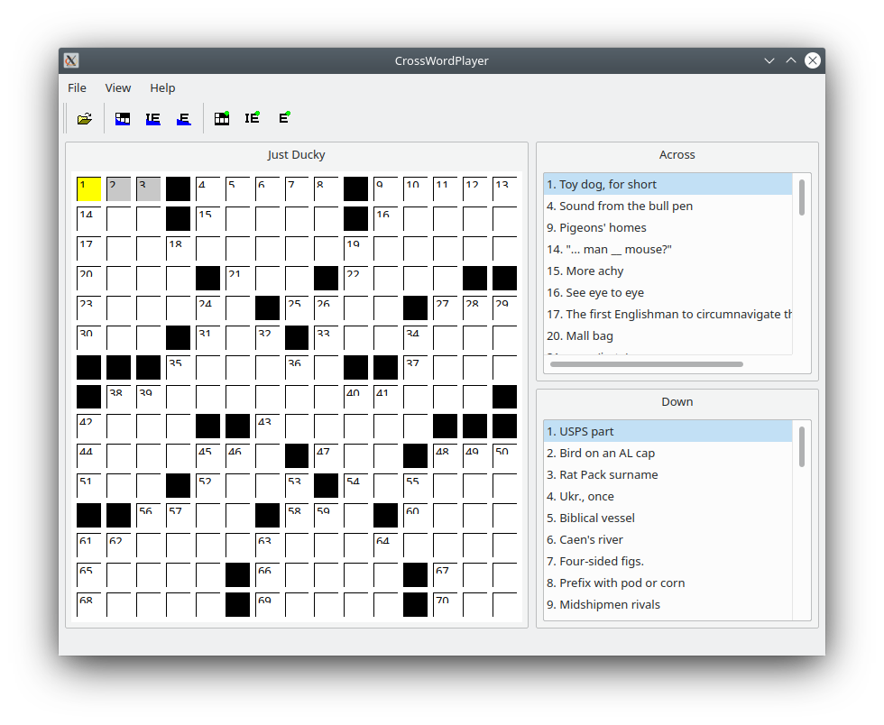

Introduction
============
CrossWordPlayer - a crossword playing program for AcrossLite .puz files.

Sample puzzels
==============

Look at the README.puz file in the "puzzels" folder for places to download .puz files.
Example .puz files are included too.

Building CrossWordPlayer
========================

Download the latest code using 'clone'.

    % git clone https://github.com/epasveer/CrossWordPlayer

Setup cmake and build

    % cd CrossWordPlayer/src
    % mkdir build
    % cd build
    % cmake ..

    % make CrossWordPlayer

Copy the CrossWordPlayer binary to your bin directory of choice. One of the below. May need
root access.

    % cd CrossWordPlayer/src/build
    % cp CrossWordPlayer ~/bin/CrossWordPlayer
    % cp CrossWordPlayer /usr/local/bin/CrossWordPlayer
    % cp CrossWordPlayer /usr/bin/CrossWordPlayer
    % rehash

Or use the 'install' make target. Which will usually copy it to /usr/local/bin.
May need root access.

    % cd CrossWordPlayer/src/build
    % sudo make install

Support/Contact
===============

    Send an email to epasveer@att.net for any bugs or features.

